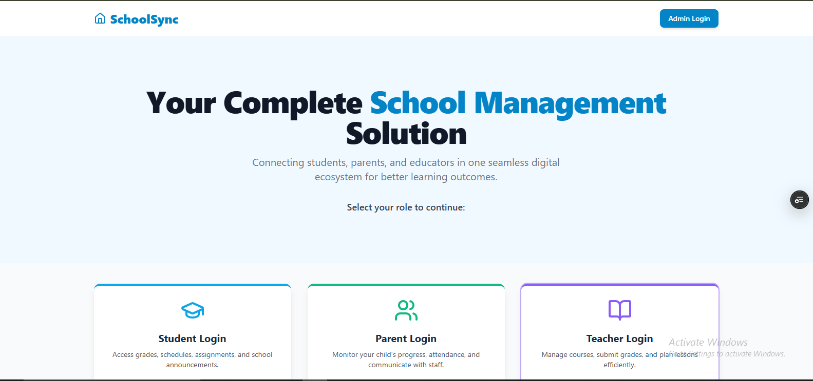
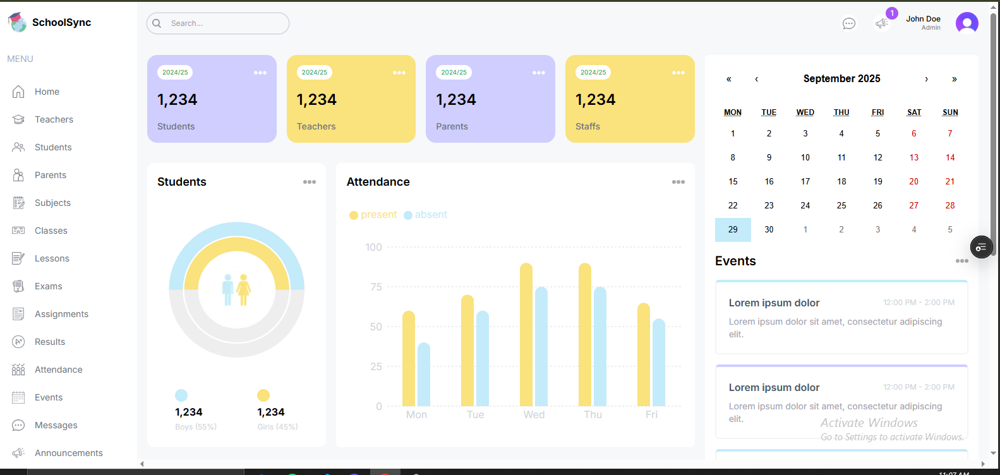
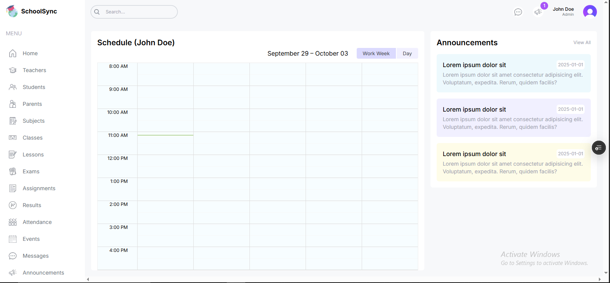
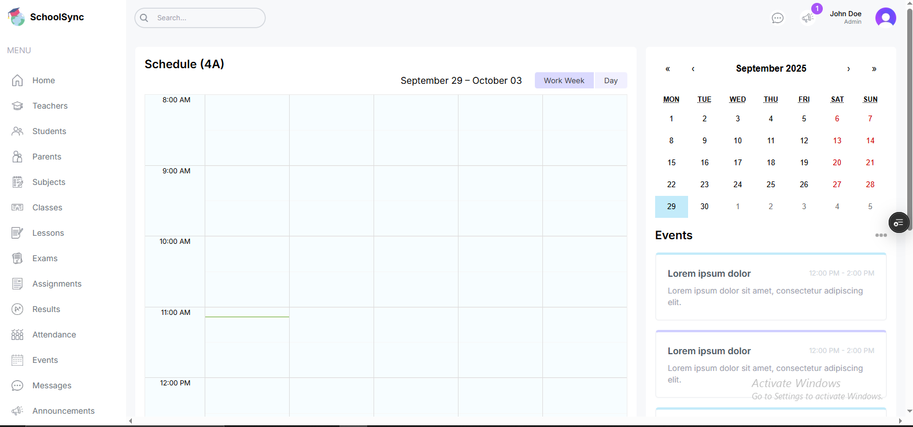

# 🏫 School Management Dashboard

[](https://nextjs.org/)  
[](https://react.dev/)  
[](https://tailwindcss.com/)  
[](https://vercel.com/)

A comprehensive school management dashboard built with **Next.js**, **TailwindCSS**, and UI components.  
Visualize student data, manage classes, attendance, and more — all in a sleek, responsive interface.

🔗 **Live Demo:** [school-management-dashboard](https://school-management-dahboard-3n3wojjq9-abu-haneefah-s-projects.vercel.app/list/exams?_vercel_share=wkPlg9t0VBzzn5ZpYSd9JR1QChtMn52h)

---

## ✨ Features

- 🧑‍🎓 **Student & Staff Management** — view lists, profiles, and details
- 📅 **Attendance Tracking** — manage check-ins, absences
- 🏫 **Class / Course Module** — assign students to classes, courses
- 📋 **Grades / Reports** — view or manage report cards
- 📊 **Statistics & Analytics** — charts for enrollment trends, attendance, etc.
- 🌙 **Dark / Light Theme Support**
- 📱 Fully **responsive layout**
- 🔧 Modular components for ease of extension

---

## 🛠 Tech Stack

- **Framework**: [Next.js](https://nextjs.org/)
- **Styling / UI**: TailwindCSS, (UI component library / ShadCN UI if used)
- **Charts / Graphs**: (e.g. Recharts, ApexCharts, etc.)
- **Icons**: (e.g. Lucide, Heroicons)
- **Deployment**: Vercel

---

## 📸 Screenshots

**Dashboard Overview**  




**Student / Class List Page**  


**Theme Toggle**  


---

## 🚀 Getting Started

### Prerequisites

- Node.js (version 16.x or higher recommended)
- npm or yarn

### Installation

```bash
git clone https://github.com/yourusername/school-management-dashboard.git
cd school-management-dashboard
npm install
# or
yarn install
```
